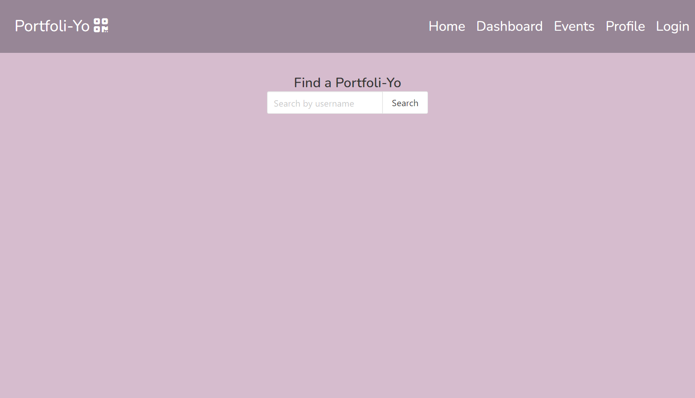

# Portfoli-Yo

## Description

Portfoli-yo is a full-stack application built using Node.js, Express.js, MySQL, Sequelize ORM, and Handlebars.js. It is designed specifically for business professionals seeking to enhance their networking experience at events. The platform offers a comprehensive suite of features, including customizable profiles with an "About Me" section, headshot, and social media links. Users can also generate QR codes for easy mobile access and post events to interact with other attendees. With Portfoli-yo, business professionals can make meaningful connections with like-minded individuals, furthering their career goals and expanding their network.

Contributions included RESTful API development, database functionality, and the creation of a responsive user interface.

## Usage

Users can search for other professionals within a community, view their portfolios, and discover upcoming networking events. 

[Deployed Link]()

## Credits

- [Helmy, Atef](https://github.com/AtefHelmy)
- [Rothman, Elva](https://github.com/erothman1)
- [Einsig, Courtney](https://github.com/CmEinsig)
- [Camaro, Mickey](https://github.com/mcamarco)
- [Bulma](https://bulma.io/)
- [QR Generator](https://www.qr-code-generator.com)
- [Google Fonts](https://fonts.google.com/)
- [Font Awesome](https://fontawesome.com/)

## License

Please refer to the LICENSE in the repo.
